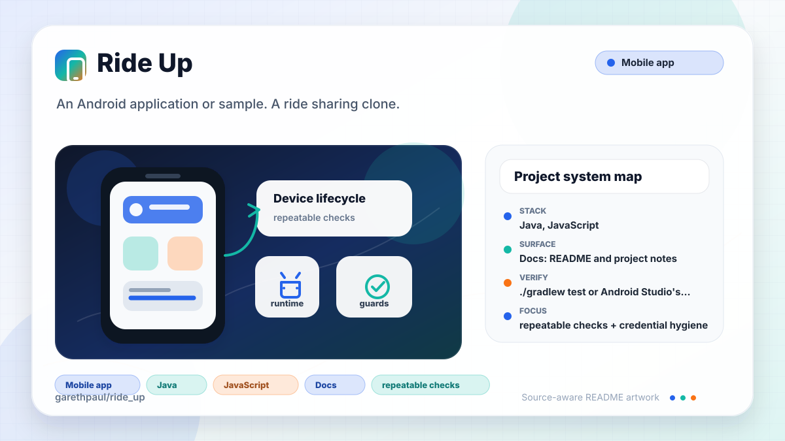

# ride_up

<!-- README-OVERVIEW-IMAGE -->


## Overview

`garethpaul/ride_up` is an Android application or sample. A ride sharing clone.

This README is based on the checked-in source, manifests, scripts, and repository metadata on the `master` branch. The project language mix found during review was: Java (3), JavaScript (1).

## Repository Contents

- `README.md` - project overview and local usage notes
- `CHANGES.md` - maintenance history for Android contract checks
- `Makefile` - local verification entry points
- `build.gradle` - Android or Gradle build configuration
- `app` - source or example code
- `docs/plans` - completed maintenance plans for the current baseline
- `gradle` - source or example code
- `gradlew` - Android or Gradle build configuration
- `javascripts` - source or example code
- `plans` - historical implementation notes
- `scripts` - static Android contract validators
- `SECURITY.md` - security reporting and disclosure guidance
- `stylesheets` - source or example code
- `VISION.md` - project direction and maintenance guardrails

Additional scan context:

- Source directories: app, gradle, javascripts, stylesheets
- Dependency and build manifests: build.gradle, gradlew
- Entry points or build surfaces: Gradle build files
- Test-looking files: app/src/androidTest/java/com/foursquare/rideup/ExampleInstrumentedTest.java, app/src/test/java/com/foursquare/rideup/ExampleUnitTest.java

## Getting Started

### Prerequisites

- Git
- Android Studio or a compatible Android SDK
- Gradle or the checked-in Gradle wrapper when present

### Setup

```bash
git clone https://github.com/garethpaul/ride_up.git
cd ride_up
cp app/src/main/java/com/foursquare/rideup/Constants.java.example app/src/main/java/com/foursquare/rideup/Constants.java
```

The setup commands above are derived from repository files. Legacy mobile, Python, or JavaScript samples may require older SDKs or package versions than a modern workstation uses by default.

Fill the copied `Constants.java` with local Mapbox and Foursquare credentials.
The real file is ignored by git; keep the checked-in `.example` file free of
secrets.

## Running or Using the Project

- Use Android Studio to open the project or run `./gradlew assembleDebug` when the Android SDK is configured.

## Testing and Verification

- `./gradlew test` or Android Studio's test runner when the SDK is configured
- `make check` runs the static Android credential, manifest, launcher export,
  application ID, landing-page package-link, and local landing asset contract
  check.
  Set `RUN_LEGACY_GRADLE=1` to also run the legacy Gradle wrapper on a machine
  with SDK 23 and the required archived Android Gradle plugin dependencies.
- The static checker also requires completed canonical plans under `docs/plans`.
- The Android manifest disables app backup so local credentials and
  location-adjacent state are not included in device backups.
- The static checker verifies the launcher activity explicitly declares its
  exported state.
- The static checker verifies Java `R.drawable.*` references resolve to
  checked-in drawable resources.
- The static checker verifies landing-page local stylesheets, favicon, and
  screenshot assets resolve inside the repository.
- The static checker also verifies PlacePicker result handling guards null
  result data, missing venue and venue-location payloads, and map updates
  before Mapbox is ready.
- The static checker verifies startup current-place lookup only runs after
  location permission is already granted.
- The static checker verifies the permission callback waits for every requested
  location permission to be granted before starting the current-place lookup.
- The static checker verifies non-location permission callbacks are forwarded
  to the superclass instead of being swallowed.
- The static checker verifies current-place callbacks ignore missing venue or
  venue-location payloads before reading coordinates.
- The static checker verifies MapView lifecycle callbacks guard missing map
  instances before forwarding lifecycle events.
- The static checker verifies local IDE metadata stays ignored and untracked.

When the required SDK or runtime is unavailable, use static checks and source review first, then verify on a machine that has the matching platform toolchain.

## Configuration and Secrets

- Detected references to Foursquare, Mapbox. Keep API keys, OAuth credentials, tokens, and account-specific values in local configuration only.

## Security and Privacy Notes

- Review changes touching external API calls or credential-adjacent configuration; examples from the scan include app/build.gradle, app/src/androidTest/java/com/foursquare/rideup/ExampleInstrumentedTest.java, app/src/main/AndroidManifest.xml, app/src/main/java/com/foursquare/rideup/MainActivity.java, and 3 more.
- Review changes touching network requests, sockets, or service endpoints; examples from the scan include app/build.gradle, app/src/androidTest/java/com/foursquare/rideup/ExampleInstrumentedTest.java, app/src/main/AndroidManifest.xml, app/src/main/res/drawable/ic_directions_run_black_24dp.xml, and 6 more.
- Review changes touching mobile permissions or privacy-sensitive device data; examples from the scan include app/src/main/AndroidManifest.xml, app/src/main/java/com/foursquare/rideup/MainActivity.java, app/src/main/res/layout/activity_main.xml, gradlew, and 1 more.
- Review changes touching file, media, JSON, XML, CSV, OCR, or data parsing; examples from the scan include .travis.yml, app/src/main/AndroidManifest.xml, app/src/main/res/layout/action_bar_custom.xml, app/src/main/res/layout/activity_main.xml, and 5 more.

## Maintenance Notes

- This looks like a legacy Android project or sample. Expect Android SDK, Gradle, and support-library versions to matter.
- See `SECURITY.md` for vulnerability reporting and safe research guidance.
- See `VISION.md` for project direction and contribution guardrails.
- See `docs/plans/2026-06-08-ride-up-baseline.md` for the canonical Android
  contract validation baseline.
- See `docs/plans/2026-06-08-android-backup-policy.md` for the app-backup
  privacy guard baseline.
- See `docs/plans/2026-06-08-drawable-reference-contract.md` for the Android
  drawable resource guard.
- See `docs/plans/2026-06-09-landing-asset-contract.md` for the landing-page
  local asset guard.
- See `docs/plans/2026-06-09-placepicker-result-guards.md` for the PlacePicker
  result-handling guard.
- See `docs/plans/2026-06-09-location-permission-startup-guard.md` for the
  startup location permission guard.
- See `docs/plans/2026-06-09-location-permission-result-guard.md` for the
  location permission callback guard.
- See `docs/plans/2026-06-09-permission-result-super-forwarding.md` for the
  non-location permission callback forwarding guard.
- See `docs/plans/2026-06-09-venue-location-guard.md` for the PlacePicker and
  current-place venue-location guard.
- See `docs/plans/2026-06-09-ide-metadata-ignore.md` for local IDE metadata
  ignore coverage.
- See `docs/plans/2026-06-09-launcher-export-contract.md` for the launcher
  activity exported-state contract.
- See `docs/plans/2026-06-10-mapview-lifecycle-guard.md` for the MapView
  lifecycle forwarding guard.

## Contributing

Keep changes small and tied to the project that is already present in this repository. For code changes, document the toolchain used, avoid committing generated dependency directories or local configuration, and update this README when setup or verification steps change.
